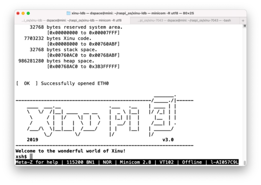

# Embedded XinuのRaspberry Pi 3 B+へのポート

## 使用したソース

基本的には1のリポジトリのコードを使用。2, 3も参考にしている。

1. https://github.com/7043mcgeep/xinu
2. https://github.com/xinu-os/xinu
3. https://github.com/LdB-ECM/Xinu

## ビルドと実行

```bash
$ cd compile/config
$ make                  # 最初に一度だけ
$ cd ../
$ make                  # ソースを修正するごとに
            # microSDをMacにセット
$ cp xinu.boot /Volume/NO NAME/kernel7.img
$ ls /Volume/NO NAME/
bootcode.bin  fixup.dat  kernel7.img  start.elf
            # microSDをアンマウントしてraspiにセット
$ minicom
            # rasupiの電源オン
```


## 実行画面例




## ドキュメントの翻訳

- [ドキュメント](file:///Users/dspace/raspi_os/xinu/docs/_build/html/index.html)
