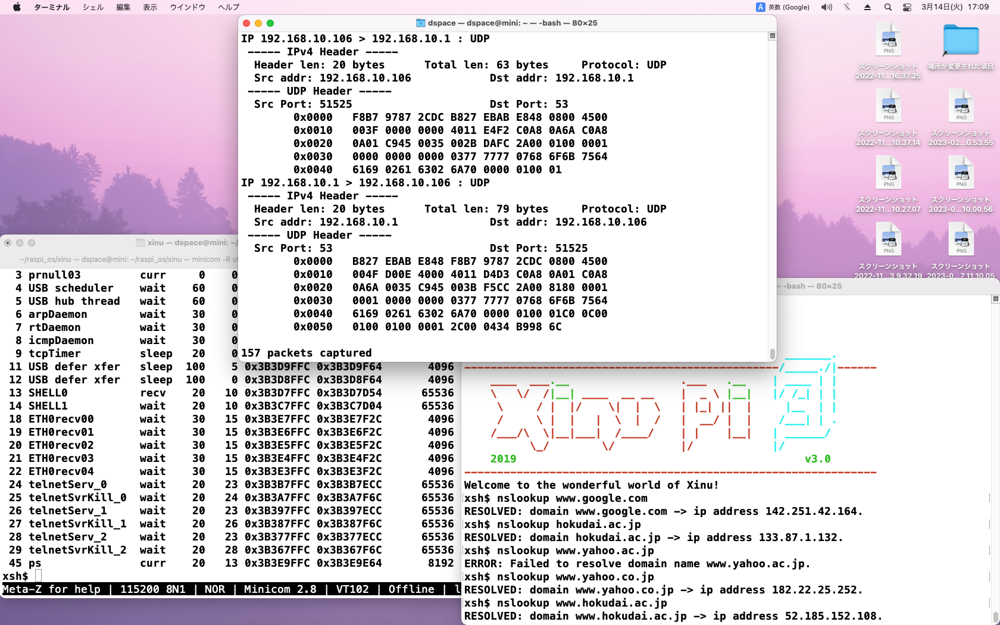

=============
実装実験メモ
=============

**************************
DHCPでDNS情報が得られるか
**************************

Discovery要求の要求リストに ``DHCP_OPT_DNS`` を追加して、DHCP_TRACEを有効化
    -> DNSサーバのIPアドレスが得られた

.. code-block:: none

    xsh$ netup
    WARNING: defaulting to network device ETH0
    Trying DHCP on ETH0...
    ../network/dhcpc/dhcpClient.c:103 (15) Sending DHCPDISCOVER
    ../network/dhcpc/dhcpClient.c:109 (15) Sent DHCPDISCOVER
    ../network/dhcpc/dhcpClient.c:121 (15) Waiting for DHCPOFFER
    ../network/dhcpc/dhcpRecvReply.c:136 (16) Received packet (len=590).
    ../network/dhcpc/dhcpRecvReply.c:169 (16) Received DHCP reply.
    ../network/dhcpc/dhcpRecvReply.c:229 (16) DHCP_OPT_MSGTYPE: 2
    ../network/dhcpc/dhcpRecvReply.c:207 (16) Reached DHCP_OPT_END.
    ../network/dhcpc/dhcpClient.c:137 (15) Sending DHCPREQUEST
    ../network/dhcpc/dhcpClient.c:143 (15) Sent DHCPREQUEST
    ../network/dhcpc/dhcpClient.c:157 (15) Waiting for DHCPACK
    ../network/dhcpc/dhcpRecvReply.c:136 (17) Received packet (len=590).
    ../network/dhcpc/dhcpRecvReply.c:169 (17) Received DHCP reply.
    ../network/dhcpc/dhcpRecvReply.c:229 (17) DHCP_OPT_MSGTYPE: 5
    ../network/dhcpc/dhcpRecvReply.c:207 (17) Reached DHCP_OPT_END.
    ../network/dhcpc/dhcpRecvReply.c:374 (17) Set ip=192.168.10.106
    ../network/dhcpc/dhcpRecvReply.c:377 (17) Set mask=255.255.255.0
    ../network/dhcpc/dhcpRecvReply.c:382 (17) Set gateway=192.168.10.1
    ../network/dhcpc/dhcpRecvReply.c:391 (17) Set dns=192.168.10.1
    ../network/dhcpc/dhcpRecvReply.c:399 (17) TFTP server=NULL
    ../network/dhcpc/dhcpRecvReply.c:400 (17) Bootfile=
    ../network/dhcpc/dhcpClient.c:163 (15) Received DHCPACK
    ETH0 is 192.168.10.106 with netmask 255.255.255.0 (gateway 192.168.10.1)
    xsh$ netstat
    ETH0:
            HW Addr: B8:27:EB:AB:E8:48
            IP Addr: 192.168.10.106    Mask: 255.255.255.0
            Gateway: 192.168.10.1      Bcast IP: 192.168.10.255
            MTU: 1500                  Link Hdr Len: 14
            Num Rcv: 0                 Num Proc: 0
    xsh$ netdown ETH0
    xsh$ netstat
    xsh$

********************
dnsメッセージの内容
********************

Macでの実行結果
===============

.. code-block:: none

    $ printf "\0\0\1\0\0\1\0\0\0\0\0\0\3www\4jprs\2co\2jp\0\0\1\0\1" | nc -u -w 1 192.168.10.1 53 | xxd
    00000000: 0000 8180 0001 0001 0000 0000 0377 7777  .............www
    00000010: 046a 7072 7302 636f 026a 7000 0001 0001  .jprs.co.jp.....
    00000020: c00c 0001 0001 0000 012c 0004 7568 85a5  .........,..uh..

    $ nslookup www.jprs.co.jp
    Server:		2400:4053:94a2:9100:fab7:97ff:fe87:2cdc
    Address:	2400:4053:94a2:9100:fab7:97ff:fe87:2cdc#53

    Non-authoritative answer:
    Name:	www.jprs.co.jp
    Address: 117.104.133.165

DNS照会
--------

.. code-block:: none

    00000000: 0000 0100 0001 0000 0000 0000 0377 7777
    00000010: 046a 7072 7302 636f 026a 7000 0001 0001

======== ========== ================================ =======================
型       名前       値の例                           解釈
======== ========== ================================ =======================
uint16_t 識別子     0000                             任意の値
uint16_t フラグ     0100                             0_0000_0_0_1 0_000_0000
uint16_t 質問数     0001                             質問は1つ
uint16_t 回答RR数   0000                             照会時は0
uint16_t 権威RR数   0000                             照会時は0
uint16_t 追加RR数   0000                             照会時は0
可変長   照会名     03777777046a70727302636f026a7000 3www4jprs2co2jp0
uint16_t 照会タイプ 0001                             A: IPアドレス
uint16_t 照会クラス 0001                             Internetアドレス
======== ========== ================================ =======================

DNS応答
--------

.. code-block:: none

    00000000: 0000 8180 0001 0001 0000 0000 0377 7777  .............www
    00000010: 046a 7072 7302 636f 026a 7000 0001 0001  .jprs.co.jp.....
    00000020: c00c 0001 0001 0000 012c 0004 7568 85a5  .........,..uh..

======== ========== ================================ ==========================
型       名前       値の例                           解釈
======== ========== ================================ ==========================
uint16_t 識別子     0000                             任意の値
uint16_t フラグ     8180                             1_0000_0_0_1 1_000_0000
uint16_t 質問数     0001                             質問は1つ
uint16_t 回答RR数   0001                             回答RRは1つ
uint16_t 権威RR数   0000                             権威RRは0
uint16_t 追加RR数   0000                             追加RRは0
可変長   照会名     03777777046a70727302636f026a7000 3www4jprs2co2jp0
uint16_t 照会タイプ 0001                             A: IPアドレス
uint16_t 照会クラス 0001                             Internetアドレス
uint16_t            c00c                             ドメイン名はオフセット0x0c
uint16_t タイプ     0001                             A
uint16_t クラス     0001                             IN
uint32_t TTL        0000012c                         300
uint16_t データ長   0004                             4バイト
可変長   データ     756885a5                         117.104.133.165
======== ========== ================================ ==========================

*****************
network/dnsを実装
*****************

1. struct netifにdnsを追加
2. ETH0固定
3. netup済を前提

修正・作成ファイル
==================

.. code-block:: none

    $ git status
    On branch rpi3
    Changes not staged for commit:
    (use "git add <file>..." to update what will be committed)
    (use "git restore <file>..." to discard changes in working directory)
        modified:   include/ipv4.h
        modified:   include/network.h
        modified:   include/nvram.h
        modified:   include/shell.h
        modified:   network/Makerules
        modified:   network/ipv4/Makerules
        modified:   network/net/netUp.c
        modified:   shell/Makerules
        modified:   shell/arptest_xshtest_unfinished.c
        modified:   shell/shell.c
        modified:   shell/xsh_kexec.c
        modified:   shell/xsh_netstat.c
        modified:   shell/xsh_netup.c
        modified:   shell/xsh_voip.c
        modified:   test/test_arp.c
        modified:   test/test_ip.c
        modified:   test/test_netif.c
        modified:   test/test_raw.c
        modified:   test/test_snoop.c

    Untracked files:
    (use "git add <file>..." to include in what will be committed)
        COPYRIGHT
        include/dns.h
        network/dns/Doxygroup.c
        network/dns/Makerules
        network/dns/dnsClient.c
        network/ipv4/int2ipv4.c
        shell/xsh_nslookup.c

実行結果
========

.. code-block:: none

    # xineで実行
    xsh$ nslookup www.google.com
    Network is down. DO netup command first!.
    xsh$ netup
    WARNING: defaulting to network device ETH0
    ETH0 is 192.168.10.106 with netmask 255.255.255.0 (gateway 192.168.10.1)(dns 192.168.10.1)
    xsh$ nslookup www.google.com
    RESOLVED: domain www.google.com -> ip address 142.251.222.36.
    xsh$ nslookup www.yahoo.co.jp
    ERROR: Failed to resolve domain name www.yahoo.co.jp.
    xsh$ nslookup edge12.g.yimg.jp
    RESOLVED: domain edge12.g.yimg.jp -> ip address 183.79.217.124.

    # Macで実行
    $ nslookup www.yahoo.co.jp
    Non-authoritative answer:
    www.yahoo.co.jp	canonical name = edge12.g.yimg.jp.
    Name:	edge12.g.yimg.jp
    Address: 182.22.28.252

問題点
======

yahooのように別名では引けない

TODO
====

CNAMEに対応する

*****************
CNAME対応
*****************

CNAMEの照会タイプは ``5``

Macで実行
=========

.. code-block:: none

    printf "\0\0\1\0\0\1\0\0\0\0\0\0\3www\5yahoo\2co\2jp\0\0\5\0\1" | nc -u -w 1 192.168.10.1 53 | xxd
    00000000: 0000 8180 0001 0001 0000 0000 0377 7777  .............www
    00000010: 0579 6168 6f6f 0263 6f02 6a70 0000 0500  .yahoo.co.jp....
    00000020: 01c0 0c00 0500 0100 0001 8f00 1006 6564  ..............ed
    00000030: 6765 3132 0167 0479 696d 67c0 19         ge12.g.yimg..

実装
====

.. code-block:: none

    $ git status
    On branch rpi3
    Changes to be committed:
    (use "git restore --staged <file>..." to unstage)
        modified:   docs/Implement_memo.rst
        modified:   include/dns.h
        modified:   network/dns/Makerules
        modified:   network/dns/dnsClient.c
        new file:   network/dns/dnsResolveA.c
        new file:   network/dns/dnsResolveCNAME.c
        new file:   network/dns/dnsUtils.c
        modified:   shell/xsh_nslookup.c

実行
====

CNAMEからAレコードの取得はできたが、最初のAレコードしか見てないので、複数ある場合は
結果が一定しない。オリジナルソースには最適のアドレスを決めるロジックがあったので検討する。

.. code-block:: none

    xsh$ nslookup yahoo.co.jp
    RESOLVED: domain yahoo.co.jp -> ip address 183.79.219.252.
    xsh$ nslookup www.yahoo.co.jp
    RESOLVED: domain www.yahoo.co.jp -> ip address 183.79.219.252.
    xsh$ nslookup edge12.g.yimg.jp
    RESOLVED: domain edge12.g.yimg.jp -> ip address 182.22.25.124.
    xsh$ nslookup yahoo.co.jp
    RESOLVED: domain yahoo.co.jp -> ip address 183.79.219.252.
    xsh$ nslookup www.yahoo.co.jp
    RESOLVED: domain www.yahoo.co.jp -> ip address 183.79.250.251.
    xsh$ nslookup edge12.g.yimg.jp
    RESOLVED: domain edge12.g.yimg.jp -> ip address 183.79.217.124.

    # macで実行
    $ dig yahoo.co.jp any
    ;; ANSWER SECTION:
    yahoo.co.jp.		75	IN	A	183.79.250.123
    yahoo.co.jp.		75	IN	A	183.79.250.251
    yahoo.co.jp.		75	IN	A	182.22.25.124
    yahoo.co.jp.		75	IN	A	183.79.219.252
    yahoo.co.jp.		75	IN	A	182.22.25.252
    yahoo.co.jp.		75	IN	A	182.22.28.252
    yahoo.co.jp.		75	IN	A	183.79.217.124
    yahoo.co.jp.		75	IN	A	182.22.16.251

*****************
telnetとsnoop
*****************

telnetとsnoopを実行してみた。

*****************
snoopPrintDns
*****************

色々と問題あり
==============

.. code-block:: none

    xsh$ snoop -dd -vv -t UDP
    Snooping... Press <Enter> to stop.
    IP 192.168.10.106 > 192.168.10.1 : UDP
    ----- Ethernet Header -----
    Dst: F8:B7:97:87:2C:DC         Src: B8:27:EB:AB:E8:48         Type: IPv4
    ----- IPv4 Header -----
    Version: 4              Header len: 20 bytes    Service: Routine
    Total len: 59 bytes     Identification: 0       Flags: 0x000
    Frag offset: 0 bytes    Time to Live: 64 hops   Protocol: UDP
    Src addr: 192.168.10.106            Dst addr: 192.168.10.1
    ----- UDP Header -----
    Src Port: 51525                     Dst Port: 53
    Message length: 39 bytes            Checksum: 0x5DF3
    ----- DNS Header -----
    ID: 618
    QR: 0 (Query)                   Opcode: 14                          Authoritative Answer: NO
    Truncation: NO                          Recursion Desired: NO
    Recursion Available: NO                          Response Code: 0 (No Error)

    Question Count: 1   Answer Count = 1   Name Server RR Count: 0   Resource RR Count: 0
    ----- Question Section 0 -----
    Question Name: d?
    Type: 0                           Class: 0
    ----- Answer Section 0 -----
    Server Name: d?
    Record Type: 0                           Class: 0
    TTL: 0   RD length: 0  RDATA: Unrecognized
        0x0000   F8B7 9787 2CDC B827 EBAB E848 0800 4500  |....,..'...H..E.|
        0x0010   003B 0000 0000 4011 E4F6 C0A8 0A6A C0A8  |.;....@......j..|
        0x0020   0A01 C945 0035 0027 5DF3 2200 0100 0001  |...E.5.'].".....|
        0x0030   0000 0000 0000 0768 6F6B 7564 6169 0261  |.......hokudai.a|
        0x0040   6302 6A70 0000 0100 01                   |c.jp.....|
    IP 192.168.10.1 > 192.168.10.106 : UDP
    ----- Ethernet Header -----
    Dst: B8:27:EB:AB:E8:48         Src: F8:B7:97:87:2C:DC         Type: IPv4
    ----- IPv4 Header -----
    Version: 4              Header len: 20 bytes    Service: Routine
    Total len: 75 bytes     Identification: 15087   Flags: 0x002
    Frag offset: 0 bytes    Time to Live: 64 hops   Protocol: UDP
    Src addr: 192.168.10.1              Dst addr: 192.168.10.106
    ----- UDP Header -----
    Src Port: 53                        Dst Port: 51525
    Message length: 55 bytes            Checksum: 0x6DB9
    ----- DNS Header -----
    ID: 20864
    QR: 0 (Query)                   Opcode: 0 (Query)                   Authoritative Answer: NO
    Truncation: NO                          Recursion Desired: NO
    Recursion Available: NO                          Response Code: 4 (Not Implemented Error)

    Question Count: 34135   Answer Count = 388   Name Server RR Count: 0   Resource RR Count: 0
    ----- Question Section 0 -----
    Question Name: d?
    Type: 0                           Class: 0
    ----- Question Section 1 -----
    Question Name: d?
    Type: 0                           Class: 0
    ...
    ----- Question Section 300 -----
    Question Name: d?
    Type: 0                           Class: 0
    ----- Question Section 301 -----
    Question Name: d?
    Type: 85                          Class: 21808
    ----- Question Section 302 -----

修正1
=====

.. code-block:: none

    xsh$ nslookup www.yahoo.co.jp
    RESOLVED: domain www.yahoo.co.jp -> ip address 183.79.219.252.

.. code-block:: none

    xsh$ snoop -dd -vv -t UDP
    Snooping... Press <Enter> to stop.

    IP 192.168.10.106 > 192.168.10.1 : UDP
    ----- Ethernet Header -----
    Dst: F8:B7:97:87:2C:DC         Src: B8:27:EB:AB:E8:48         Type: IPv4
    ----- IPv4 Header -----
    Version: 4              Header len: 20 bytes    Service: Routine
    Total len: 61 bytes     Identification: 0       Flags: 0x000
    Frag offset: 0 bytes    Time to Live: 64 hops   Protocol: UDP
    Src addr: 192.168.10.106            Dst addr: 192.168.10.1
    ----- UDP Header -----
    Src Port: 51525                     Dst Port: 53
    Message length: 41 bytes            Checksum: 0x4C4F
    ----- DNS Header -----
    ID: 0x0024 (9216)     QR: 0 (Query)         Opcode: 0 (Query)
    AA: 0 NO              TC: 0 NO              RD: 1 (YES)
    RA: 0 NO              RCODE: 0 (No Error)
    QUC: 1   ANC: 0   NSC: 0   ARC: 0
    ----- Question Section 0 -----
    Question Name: www.yahoo.co.jp
    Type: 1 (Host Address)            Class: 1 (Internet)

        0x0000   F8B7 9787 2CDC B827 EBAB E848 0800 4500  |....,..'...H..E.|
        0x0010   003D 0000 0000 4011 E4F4 C0A8 0A6A C0A8  |.=....@......j..|
        0x0020   0A01 C945 0035 0029 4C4F 2400 0100 0001  |...E.5.)LO$.....|
        0x0030   0000 0000 0000 0377 7777 0579 6168 6F6F  |.......www.yahoo|
        0x0040   0263 6F02 6A70 0000 0100 01              |.co.jp.....|

    IP 192.168.10.1 > 192.168.10.106 : UDP
    ----- Ethernet Header -----
    Dst: B8:27:EB:AB:E8:48         Src: F8:B7:97:87:2C:DC         Type: IPv4
    ----- IPv4 Header -----
    Version: 4              Header len: 20 bytes    Service: Routine
    Total len: 105 bytes    Identification: 32181   Flags: 0x002
    Frag offset: 0 bytes    Time to Live: 64 hops   Protocol: UDP
    Src addr: 192.168.10.1              Dst addr: 192.168.10.106
    ----- UDP Header -----
    Src Port: 53                        Dst Port: 51525
    Message length: 85 bytes            Checksum: 0x2730
    ----- DNS Header -----
    ID: 0x0024 (9216)     QR: 1 (Response)      Opcode: 0 (Query)
    AA: 0 NO              TC: 0 NO              RD: 1 (YES)
    RA: 1 (YES)           RCODE: 0 (No Error)
    QUC: 1   ANC: 2   NSC: 0   ARC: 0
    ----- Question Section 0 -----
    Question Name: www.yahoo.co.jp
    Type: 1 (Host Address)            Class: 1 (Internet)
    ----- Answer Section 0 -----
    Domain Name: www.yahoo.co.jp
    Record Type: 5 (Canonical Name)                    Class: 1 (Internet)
    TTL: 0x07020000 (0)              RD length: 0x1000 (16)
    RDATA: edge12.g.yimg.jp
    ----- Answer Section 1 -----
    Domain Name: edge12.g.yimg.jp
    Record Type: 1 (Host Address)                      Class: 1 (Internet)
    TTL: 0x0d000000 (0)              RD length: 0x0400 (4)
    RData: 183.79.250.251

        0x0000   B827 EBAB E848 F8B7 9787 2CDC 0800 4500  |.'...H....,...E.|
        0x0010   0069 7DB5 4000 4011 2713 C0A8 0A01 C0A8  |.i}.@.@.'.......|
        0x0020   0A6A 0035 C945 0055 2730 2400 8180 0001  |.j.5.E.U'0$.....|
        0x0030   0002 0000 0000 0377 7777 0579 6168 6F6F  |.......www.yahoo|
        0x0040   0263 6F02 6A70 0000 0100 01C0 0C00 0500  |.co.jp..........|
        0x0050   0100 0002 0700 1006 6564 6765 3132 0167  |........edge12.g|
        0x0060   0479 696D 67C0 19C0 2D00 0100 0100 0000  |.yimg...-.......|
        0x0070   0D00 04B7 4FFA FB                        |....O..|

    IP 192.168.10.106 > 192.168.10.1 : UDP
    ----- Ethernet Header -----
    Dst: F8:B7:97:87:2C:DC         Src: B8:27:EB:AB:E8:48         Type: IPv4
    ----- IPv4 Header -----
    Version: 4              Header len: 20 bytes    Service: Routine
    Total len: 61 bytes     Identification: 0       Flags: 0x000
    Frag offset: 0 bytes    Time to Live: 64 hops   Protocol: UDP
    Src addr: 192.168.10.106            Dst addr: 192.168.10.1
    ----- UDP Header -----
    Src Port: 51525                     Dst Port: 53
    Message length: 41 bytes            Checksum: 0x4C4F
    ----- DNS Header -----
    ID: 0x0024 (9216)     QR: 0 (Query)         Opcode: 0 (Query)
    AA: 0 NO              TC: 0 NO              RD: 1 (YES)
    RA: 0 NO              RCODE: 0 (No Error)
    QUC: 1   ANC: 0   NSC: 0   ARC: 0
    ----- Question Section 0 -----
    Question Name: www.yahoo.co.jp
    Type: 1 (Host Address)            Class: 1 (Internet)

        0x0000   F8B7 9787 2CDC B827 EBAB E848 0800 4500  |....,..'...H..E.|
        0x0010   003D 0000 0000 4011 E4F4 C0A8 0A6A C0A8  |.=....@......j..|
        0x0020   0A01 C945 0035 0029 4C4F 2400 0100 0001  |...E.5.)LO$.....|
        0x0030   0000 0000 0000 0377 7777 0579 6168 6F6F  |.......www.yahoo|
        0x0040   0263 6F02 6A70 0000 0100 01              |.co.jp.....|

    IP 192.168.10.1 > 192.168.10.106 : UDP
    ----- Ethernet Header -----
    Dst: B8:27:EB:AB:E8:48         Src: F8:B7:97:87:2C:DC         Type: IPv4
    ----- IPv4 Header -----
    Version: 4              Header len: 20 bytes    Service: Routine
    Total len: 105 bytes    Identification: 32182   Flags: 0x002
    Frag offset: 0 bytes    Time to Live: 64 hops   Protocol: UDP
    Src addr: 192.168.10.1              Dst addr: 192.168.10.106
    ----- UDP Header -----
    Src Port: 53                        Dst Port: 51525
    Message length: 85 bytes            Checksum: 0x064E
    ----- DNS Header -----
    ID: 0x0024 (9216)     QR: 1 (Response)      Opcode: 0 (Query)
    AA: 0 NO              TC: 0 NO              RD: 1 (YES)
    RA: 1 (YES)           RCODE: 0 (No Error)
    QUC: 1   ANC: 2   NSC: 0   ARC: 0
    ----- Question Section 0 -----
    Question Name: www.yahoo.co.jp
    Type: 1 (Host Address)            Class: 1 (Internet)
    ----- Answer Section 0 -----
    Domain Name: www.yahoo.co.jp
    Record Type: 5 (Canonical Name)                    Class: 1 (Internet)
    TTL: 0x27030000 (0)              RD length: 0x1000 (16)
    RDATA: edge12.g.yimg.jp
    ----- Answer Section 1 -----
    Domain Name: edge12.g.yimg.jp
    Record Type: 1 (Host Address)                      Class: 1 (Internet)
    TTL: 0x0d000000 (0)              RD length: 0x0400 (4)
    RData: 183.79.219.252

        0x0000   B827 EBAB E848 F8B7 9787 2CDC 0800 4500  |.'...H....,...E.|
        0x0010   0069 7DB6 4000 4011 2712 C0A8 0A01 C0A8  |.i}.@.@.'.......|
        0x0020   0A6A 0035 C945 0055 064E 2400 8180 0001  |.j.5.E.U.N$.....|
        0x0030   0002 0000 0000 0377 7777 0579 6168 6F6F  |.......www.yahoo|
        0x0040   0263 6F02 6A70 0000 0100 01C0 0C00 0500  |.co.jp..........|
        0x0050   0100 0003 2700 1006 6564 6765 3132 0167  |....'...edge12.g|
        0x0060   0479 696D 67C0 19C0 2D00 0100 0100 0000  |.yimg...-.......|
        0x0070   0D00 04B7 4FDB FC                        |....O..|

    IP 192.168.10.106 > 192.168.10.1 : UDP
    ----- Ethernet Header -----
    Dst: F8:B7:97:87:2C:DC         Src: B8:27:EB:AB:E8:48         Type: IPv4
    ----- IPv4 Header -----
    Version: 4              Header len: 20 bytes    Service: Routine
    Total len: 61 bytes     Identification: 0       Flags: 0x000
    Frag offset: 0 bytes    Time to Live: 64 hops   Protocol: UDP
    Src addr: 192.168.10.106            Dst addr: 192.168.10.1
    ----- UDP Header -----
    Src Port: 51525                     Dst Port: 53
    Message length: 41 bytes            Checksum: 0x4C4F
    ----- DNS Header -----
    ID: 0x0024 (9216)     QR: 0 (Query)         Opcode: 0 (Query)
    AA: 0 NO              TC: 0 NO              RD: 1 (YES)
    RA: 0 NO              RCODE: 0 (No Error)
    QUC: 1   ANC: 0   NSC: 0   ARC: 0
    ----- Question Section 0 -----
    Question Name: www.yahoo.co.jp
    Type: 1 (Host Address)            Class: 1 (Internet)

        0x0000   F8B7 9787 2CDC B827 EBAB E848 0800 4500  |....,..'...H..E.|
        0x0010   003D 0000 0000 4011 E4F4 C0A8 0A6A C0A8  |.=....@......j..|
        0x0020   0A01 C945 0035 0029 4C4F 2400 0100 0001  |...E.5.)LO$.....|
        0x0030   0000 0000 0000 0377 7777 0579 6168 6F6F  |.......www.yahoo|
        0x0040   0263 6F02 6A70 0000 0100 01              |.co.jp.....|

    IP 192.168.10.1 > 192.168.10.106 : UDP
    ----- Ethernet Header -----
    Dst: B8:27:EB:AB:E8:48         Src: F8:B7:97:87:2C:DC         Type: IPv4
    ----- IPv4 Header -----
    Version: 4              Header len: 20 bytes    Service: Routine
    Total len: 105 bytes    Identification: 32184   Flags: 0x002
    Frag offset: 0 bytes    Time to Live: 64 hops   Protocol: UDP
    Src addr: 192.168.10.1              Dst addr: 192.168.10.106
    ----- UDP Header -----
    Src Port: 53                        Dst Port: 51525
    Message length: 85 bytes            Checksum: 0xBD4D
    ----- DNS Header -----
    ID: 0x0024 (9216)     QR: 1 (Response)      Opcode: 0 (Query)
    AA: 0 NO              TC: 0 NO              RD: 1 (YES)
    RA: 1 (YES)           RCODE: 0 (No Error)
    QUC: 1   ANC: 2   NSC: 0   ARC: 0
    ----- Question Section 0 -----
    Question Name: www.yahoo.co.jp
    Type: 1 (Host Address)            Class: 1 (Internet)
    ----- Answer Section 0 -----
    Domain Name: www.yahoo.co.jp
    Record Type: 5 (Canonical Name)                    Class: 1 (Internet)
    TTL: 0x70030000 (0)              RD length: 0x1000 (16)
    RDATA: edge12.g.yimg.jp
    ----- Answer Section 1 -----
    Domain Name: edge12.g.yimg.jp
    Record Type: 1 (Host Address)                      Class: 1 (Internet)
    TTL: 0x0d000000 (0)              RD length: 0x0400 (4)
    RData: 183.79.219.252

        0x0000   B827 EBAB E848 F8B7 9787 2CDC 0800 4500  |.'...H....,...E.|
        0x0010   0069 7DB8 4000 4011 2710 C0A8 0A01 C0A8  |.i}.@.@.'.......|
        0x0020   0A6A 0035 C945 0055 BD4D 2400 8180 0001  |.j.5.E.U.M$.....|
        0x0030   0002 0000 0000 0377 7777 0579 6168 6F6F  |.......www.yahoo|
        0x0040   0263 6F02 6A70 0000 0100 01C0 0C00 0500  |.co.jp..........|
        0x0050   0100 0003 7000 1006 6564 6765 3132 0167  |....p...edge12.g|
        0x0060   0479 696D 67C0 19C0 2D00 0100 0100 0000  |.yimg...-.......|
        0x0070   0D00 04B7 4FDB FC                        |....O..|

    IP 192.168.10.106 > 192.168.10.1 : UDP
    ----- Ethernet Header -----
    Dst: F8:B7:97:87:2C:DC         Src: B8:27:EB:AB:E8:48         Type: IPv4
    ----- IPv4 Header -----
    Version: 4              Header len: 20 bytes    Service: Routine
    Total len: 61 bytes     Identification: 0       Flags: 0x000
    Frag offset: 0 bytes    Time to Live: 64 hops   Protocol: UDP
    Src addr: 192.168.10.106            Dst addr: 192.168.10.1
    ----- UDP Header -----
    Src Port: 51525                     Dst Port: 53
    Message length: 41 bytes            Checksum: 0x484F
    ----- DNS Header -----
    ID: 0x0024 (9216)     QR: 0 (Query)         Opcode: 0 (Query)
    AA: 0 NO              TC: 0 NO              RD: 1 (YES)
    RA: 0 NO              RCODE: 0 (No Error)
    QUC: 1   ANC: 0   NSC: 0   ARC: 0
    ----- Question Section 0 -----
    Question Name: www.yahoo.co.jp
    Type: 5 (Canonical Name)          Class: 1 (Internet)

        0x0000   F8B7 9787 2CDC B827 EBAB E848 0800 4500  |....,..'...H..E.|
        0x0010   003D 0000 0000 4011 E4F4 C0A8 0A6A C0A8  |.=....@......j..|
        0x0020   0A01 C945 0035 0029 484F 2400 0100 0001  |...E.5.)HO$.....|
        0x0030   0000 0000 0000 0377 7777 0579 6168 6F6F  |.......www.yahoo|
        0x0040   0263 6F02 6A70 0000 0500 01              |.co.jp.....|

    IP 192.168.10.1 > 192.168.10.106 : UDP
    ----- Ethernet Header -----
    Dst: B8:27:EB:AB:E8:48         Src: F8:B7:97:87:2C:DC         Type: IPv4
    ----- IPv4 Header -----
    Version: 4              Header len: 20 bytes    Service: Routine
    Total len: 89 bytes     Identification: 32185   Flags: 0x002
    Frag offset: 0 bytes    Time to Live: 64 hops   Protocol: UDP
    Src addr: 192.168.10.1              Dst addr: 192.168.10.106
    ----- UDP Header -----
    Src Port: 53                        Dst Port: 51525
    Message length: 69 bytes            Checksum: 0x43C2
    ----- DNS Header -----
    ID: 0x0024 (9216)     QR: 1 (Response)      Opcode: 0 (Query)
    AA: 0 NO              TC: 0 NO              RD: 1 (YES)
    RA: 1 (YES)           RCODE: 0 (No Error)
    QUC: 1   ANC: 1   NSC: 0   ARC: 0
    ----- Question Section 0 -----
    Question Name: www.yahoo.co.jp
    Type: 5 (Canonical Name)          Class: 1 (Internet)
    ----- Answer Section 0 -----
    Domain Name: www.yahoo.co.jp
    Record Type: 5 (Canonical Name)                    Class: 1 (Internet)
    TTL: 0x73030000 (0)              RD length: 0x1000 (16)
    RDATA: edge12.g.yimg.jp

        0x0000   B827 EBAB E848 F8B7 9787 2CDC 0800 4500  |.'...H....,...E.|
        0x0010   0059 7DB9 4000 4011 271F C0A8 0A01 C0A8  |.Y}.@.@.'.......|
        0x0020   0A6A 0035 C945 0045 43C2 2400 8180 0001  |.j.5.E.EC.$.....|
        0x0030   0001 0000 0000 0377 7777 0579 6168 6F6F  |.......www.yahoo|
        0x0040   0263 6F02 6A70 0000 0500 01C0 0C00 0500  |.co.jp..........|
        0x0050   0100 0003 7300 1006 6564 6765 3132 0167  |....s...edge12.g|
        0x0060   0479 696D 67C0 19                        |.yimg..|

    IP 192.168.10.106 > 192.168.10.1 : UDP
    ----- Ethernet Header -----
    Dst: F8:B7:97:87:2C:DC         Src: B8:27:EB:AB:E8:48         Type: IPv4
    ----- IPv4 Header -----
    Version: 4              Header len: 20 bytes    Service: Routine
    Total len: 62 bytes     Identification: 0       Flags: 0x000
    Frag offset: 0 bytes    Time to Live: 64 hops   Protocol: UDP
    Src addr: 192.168.10.106            Dst addr: 192.168.10.1
    ----- UDP Header -----
    Src Port: 51525                     Dst Port: 53
    Message length: 42 bytes            Checksum: 0xB921
    ----- DNS Header -----
    ID: 0x0024 (9216)     QR: 0 (Query)         Opcode: 0 (Query)
    AA: 0 NO              TC: 0 NO              RD: 1 (YES)
    RA: 0 NO              RCODE: 0 (No Error)
    QUC: 1   ANC: 0   NSC: 0   ARC: 0
    ----- Question Section 0 -----
    Question Name: edge12.g.yimg.jp
    Type: 1 (Host Address)            Class: 1 (Internet)

        0x0000   F8B7 9787 2CDC B827 EBAB E848 0800 4500  |....,..'...H..E.|
        0x0010   003E 0000 0000 4011 E4F3 C0A8 0A6A C0A8  |.>....@......j..|
        0x0020   0A01 C945 0035 002A B921 2400 0100 0001  |...E.5.*.!$.....|
        0x0030   0000 0000 0000 0665 6467 6531 3201 6704  |.......edge12.g.|
        0x0040   7969 6D67 026A 7000 0001 0001            |yimg.jp.....|

    IP 192.168.10.1 > 192.168.10.106 : UDP
    ----- Ethernet Header -----
    Dst: B8:27:EB:AB:E8:48         Src: F8:B7:97:87:2C:DC         Type: IPv4
    ----- IPv4 Header -----
    Version: 4              Header len: 20 bytes    Service: Routine
    Total len: 78 bytes     Identification: 32187   Flags: 0x002
    Frag offset: 0 bytes    Time to Live: 64 hops   Protocol: UDP
    Src addr: 192.168.10.1              Dst addr: 192.168.10.106
    ----- UDP Header -----
    Src Port: 53                        Dst Port: 51525
    Message length: 58 bytes            Checksum: 0xE513
    ----- DNS Header -----
    ID: 0x0024 (9216)     QR: 1 (Response)      Opcode: 0 (Query)
    AA: 0 NO              TC: 0 NO              RD: 1 (YES)
    RA: 1 (YES)           RCODE: 0 (No Error)
    QUC: 1   ANC: 1   NSC: 0   ARC: 0
    ----- Question Section 0 -----
    Question Name: edge12.g.yimg.jp
    Type: 1 (Host Address)            Class: 1 (Internet)
    ----- Answer Section 0 -----
    Domain Name: edge12.g.yimg.jp
    Record Type: 1 (Host Address)                      Class: 1 (Internet)
    TTL: 0x0d000000 (0)              RD length: 0x0400 (4)
    RData: 183.79.219.252

        0x0000   B827 EBAB E848 F8B7 9787 2CDC 0800 4500  |.'...H....,...E.|
        0x0010   004E 7DBB 4000 4011 2728 C0A8 0A01 C0A8  |.N}.@.@.'(......|
        0x0020   0A6A 0035 C945 003A E513 2400 8180 0001  |.j.5.E.:..$.....|
        0x0030   0001 0000 0000 0665 6467 6531 3201 6704  |.......edge12.g.|
        0x0040   7969 6D67 026A 7000 0001 0001 C00C 0001  |yimg.jp.........|
        0x0050   0001 0000 000D 0004 B74F DBFC            |.........O..|

    565 packets captured
    10 packets matched filter
    10 packets printed
    0 packets overrun

修正2
=====

DNSパケットのsnoopは問題なくなったが、dnsの解決で最初の応答でCNAMEとそのIPが
返されているのに何度も質問を続けている。dnsGetA()を修正した。

.. code-block:: none

    xsh$ nslookup www.yahoo.co.jp
    RESOLVED: domain www.yahoo.co.jp -> ip address 183.79.219.252.

.. code-block:: none

    xsh$ snoop -dd -vv -t UDP
    Snooping... Press <Enter> to stop.

    IP 192.168.10.106 > 192.168.10.1 : UDP
    ----- Ethernet Header -----
    Dst: F8:B7:97:87:2C:DC         Src: B8:27:EB:AB:E8:48         Type: IPv4
    ----- IPv4 Header -----
    Version: 4              Header len: 20 bytes    Service: Routine
    Total len: 61 bytes     Identification: 0       Flags: 0x000
    Frag offset: 0 bytes    Time to Live: 64 hops   Protocol: UDP
    Src addr: 192.168.10.106            Dst addr: 192.168.10.1
    ----- UDP Header -----
    Src Port: 51525                     Dst Port: 53
    Message length: 41 bytes            Checksum: 0x4D4F
    ----- DNS Header -----
    ID: 0x0023 (8960)     QR: 0 (Query)         Opcode: 0 (Query)
    AA: 0 NO              TC: 0 NO              RD: 1 (YES)
    RA: 0 NO              RCODE: 0 (No Error)
    QUC: 1   ANC: 0   NSC: 0   ARC: 0
    ----- Question Section 0 -----
    Question Name: www.yahoo.co.jp
    Type: 1 (Host Address)            Class: 1 (Internet)

        0x0000   F8B7 9787 2CDC B827 EBAB E848 0800 4500  |....,..'...H..E.|
        0x0010   003D 0000 0000 4011 E4F4 C0A8 0A6A C0A8  |.=....@......j..|
        0x0020   0A01 C945 0035 0029 4D4F 2300 0100 0001  |...E.5.)MO#.....|
        0x0030   0000 0000 0000 0377 7777 0579 6168 6F6F  |.......www.yahoo|
        0x0040   0263 6F02 6A70 0000 0100 01              |.co.jp.....|

    IP 192.168.10.1 > 192.168.10.106 : UDP
    ----- Ethernet Header -----
    Dst: B8:27:EB:AB:E8:48         Src: F8:B7:97:87:2C:DC         Type: IPv4
    ----- IPv4 Header -----
    Version: 4              Header len: 20 bytes    Service: Routine
    Total len: 105 bytes    Identification: 39577   Flags: 0x002
    Frag offset: 0 bytes    Time to Live: 64 hops   Protocol: UDP
    Src addr: 192.168.10.1              Dst addr: 192.168.10.106
    ----- UDP Header -----
    Src Port: 53                        Dst Port: 51525
    Message length: 85 bytes            Checksum: 0x824F
    ----- DNS Header -----
    ID: 0x0023 (8960)     QR: 1 (Response)      Opcode: 0 (Query)
    AA: 0 NO              TC: 0 NO              RD: 1 (YES)
    RA: 1 (YES)           RCODE: 0 (No Error)
    QUC: 1   ANC: 2   NSC: 0   ARC: 0
    ----- Question Section 0 -----
    Question Name: www.yahoo.co.jp
    Type: 1 (Host Address)            Class: 1 (Internet)
    ----- Answer Section 0 -----
    Domain Name: www.yahoo.co.jp
    Record Type: 5 (Canonical Name)                    Class: 1 (Internet)
    TTL: 0xb2010000 (0)              RD length: 0x1000 (16)
    RDATA: edge12.g.yimg.jp
    ----- Answer Section 1 -----
    Domain Name: edge12.g.yimg.jp
    Record Type: 1 (Host Address)                      Class: 1 (Internet)
    TTL: 0x07000000 (0)              RD length: 0x0400 (4)
    RData: 183.79.219.252                                                       # 1回の応答で返答している

        0x0000   B827 EBAB E848 F8B7 9787 2CDC 0800 4500  |.'...H....,...E.|
        0x0010   0069 9A99 4000 4011 0A2F C0A8 0A01 C0A8  |.i..@.@../......|
        0x0020   0A6A 0035 C945 0055 824F 2300 8180 0001  |.j.5.E.U.O#.....|
        0x0030   0002 0000 0000 0377 7777 0579 6168 6F6F  |.......www.yahoo|
        0x0040   0263 6F02 6A70 0000 0100 01C0 0C00 0500  |.co.jp..........|
        0x0050   0100 0001 B200 1006 6564 6765 3132 0167  |........edge12.g|
        0x0060   0479 696D 67C0 19C0 2D00 0100 0100 0000  |.yimg...-.......|
        0x0070   0700 04B7 4FDB FC                        |....O..|
